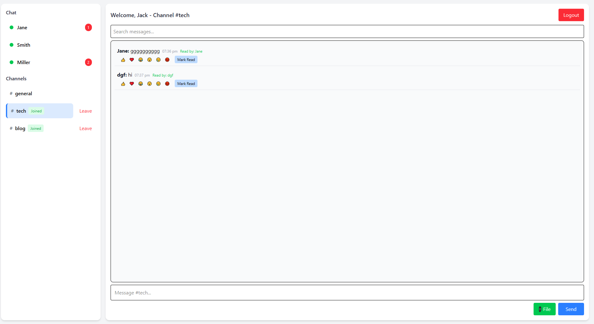

# Real-Time Chat Application with Socket.io

A full-featured real-time chat application built with Express.js, React, Node.js and Socket.io for bidirectional communication. This application demonstrates modern web development practices with real-time messaging, multiple chat rooms, file sharing, and comprehensive user experience features.

## 🚀 Live Demo

- **Frontend**: [https://socket-chatapp-frontend.onrender.com](https://socket-chatapp-frontend.onrender.com)
- **Backend API**: [https://socket-chatapp-backend.onrender.com](https://socket-chatapp-backend.onrender.com)

## 📋 Table of Contents

## 📋 Table of Contents

- [Features](#-features)
- [Technologies Used](#-technologies-used)
- [Prerequisites](#-prerequisites)
- [Installation](#-installation)
- [Environment Setup](#-environment-setup)
- [Running the Application](#-running-the-application)
- [Getting Started with the Chat App](#-getting-started-with-the-chat-app)
- [Project Structure](#-project-structure)
- [API Endpoints](#-api-endpoints)
- [Deployment](#-deployment)
- [Screenshots](#-screenshots)
- [Contributing](#-contributing)
- [License](#-license)


## ✨ Features

### Core Chat Functionality
- ✅ **Real-time messaging** with Socket.io
- ✅ **User authentication** with username-based login
- ✅ **Multiple chat rooms/channels** (General, Tech, Blog)
- ✅ **Private messaging** between users
- ✅ **Online/offline status** indicators
- ✅ **Typing indicators** showing when users are composing messages
- ✅ **Message timestamps** with proper formatting

### Advanced Features
- ✅ **File and image sharing** with upload functionality
- ✅ **Message reactions** (👍, ❤️, 😂, 😮, 😢, 😡)
- ✅ **Read receipts** for message delivery confirmation
- ✅ **Message search** functionality
- ✅ **Channel join/leave notifications**
- ✅ **Unread message counts** with badges

### Notifications & UX
- ✅ **Sound notifications** for new messages
- ✅ **Browser notifications** (Web Notifications API)
- ✅ **Mobile responsive** design
- ✅ **Auto-reconnection** logic for network issues
- ✅ **Message history** persistence per channel
- ✅ **Modern UI** with Tailwind CSS

## 🛠 Technologies Used

### Frontend
- **React 19** - Modern React with hooks
- **Vite** - Fast build tool and dev server
- **Socket.io Client** - Real-time communication
- **React Router** - Client-side routing
- **Tailwind CSS** - Utility-first CSS framework


### Backend
- **Node.js** - JavaScript runtime
- **Express.js** - Web framework
- **Socket.io** - Real-time bidirectional communication
- **Multer** - File upload middleware
- **CORS** - Cross-origin resource sharing
- **Dotenv** - Environment variable management

### Development Tools
- **ESLint** - Code linting
- **Nodemon** - Auto-restart for development
- **Vite** - Frontend build and dev server

## 📋 Prerequisites

Before running this application, make sure you have the following installed:

- **Node.js** (v16 or higher) - [Download here](https://nodejs.org/)
- **npm** (comes with Node.js) or **yarn**
- **Git** - [Download here](https://git-scm.com/)

## 🚀 Installation

1. **Clone the repository:**
   ```bash
   git clone https://github.com/PLP-MERN-Stack-Development/real-time-communication-with-socket-io-vee-kodes.git
   cd real-time-communication-with-socket-io-vee-kodes
   ```

2. **Install server dependencies:**
   ```bash
   cd server
   npm install
   ```

3. **Install client dependencies:**
   ```bash
   cd ../client
   npm install
   ```

## 🔧 Environment Setup

### Server Environment (.env)
Create a `.env` file in the `server` directory:

```env
PORT=5000
CLIENT_URL=http://localhost:5173
```

### Client Environment (.env)
Create a `.env` file in the `client` directory:

```env
VITE_SOCKET_URL=http://localhost:5000
```

## ▶️ Running the Application

### Development Mode

1. **Start the backend server:**
   ```bash
   cd server
   npm run dev
   ```
   Server will run on `http://localhost:5000`

2. **Start the frontend client:**
   ```bash
   cd client
   npm run dev
   ```
   Client will run on `http://localhost:5173`

3. **Open your browser** and navigate to `http://localhost:5173`

### Production Build

1. **Build the client:**
   ```bash
   cd client
   npm run build
   ```

2. **Start the server:**
   ```bash
   cd server
   npm start
   ```

## 🚀 Getting Started with the Chat App

### **Best Experience Setup:**
To fully experience all the real-time features of this chat application, we recommend opening **multiple browser tabs/windows** and joining with different usernames. This allows you to test:

- **Real-time messaging** across different users
- **Private messaging** between specific users  
- **Channel interactions** with multiple participants
- **Typing indicators** and **online status**
- **Notifications** and **unread message counts**
- **Message reactions** and **read receipts**

### **Quick Test Setup:**
1. **Open 2-3 browser tabs** to `http://localhost:5174` (or your deployed URL)
2. **Join each tab** with a different username (e.g., "Alice", "Bob", "Charlie")
3. **Start chatting!** Try sending messages, switching channels, and using private messaging
4. **Test notifications** by having one user send messages while others are in different channels

### **Feature Testing Checklist:**
- ✅ Send public messages in channels
- ✅ Send private messages between users
- ✅ Join/leave different channels
- ✅ React to messages with emojis
- ✅ Upload and share files
- ✅ Check typing indicators
- ✅ Monitor online/offline status
- ✅ Test browser notifications
- ✅ Use message search functionality


## 📁 Project Structure

```
real-time-communication-with-socket-io-vee-kodes/
├── client/                          # React frontend
│   ├── public/                      # Static assets
│   │   ├── notification.mp3         # Notification sound
│   │   └── vite.svg                # Vite logo
│   ├── src/
│   │   ├── assets/                 # Images and icons
│   │   ├── components/             # Reusable components
│   │   ├── pages/                  # Page components
│   │   │   ├── Login.jsx           # Login page
│   │   │   └── Chat.jsx            # Main chat interface
│   │   ├── socket/                 # Socket.io client logic
│   │   │   └── socket.js           # Socket connection and hooks
│   │   ├── App.jsx                 # Main app component
│   │   ├── main.jsx                # App entry point
│   │   └── index.css               # Global styles
│   ├── index.html                  # Main HTML template
│   ├── package.json                # Project configuration
│   └── vite.config.js              # Vite build tool configuration
├── server/                          # Node.js backend
│   ├── public/
│   │   └── uploads/                # File upload directory
│   ├── server.js                   # Main server file
│   ├── package.json                # Project configuration
│   └── .env                        # Environment variables
├── screenshots/                    # App screenshots
├── README.md                       # Assignment requirements
└── Week5-Assignment.md             # Assignment requirements
└──README_ChatApp.md                # This project documentation 
```

## 🔌 API Endpoints

### Server Endpoints
- `GET /` - Server status
- `GET /api/channels` - Get available channels
- `GET /api/users` - Get online users
- `POST /api/upload` - Upload files

### Socket.io Events

#### Client → Server
- `user_join` - User joins the chat
- `send_message` - Send public message
- `send_channel_message` - Send message to specific channel
- `private_message` - Send private message
- `join_channel` - Join a channel
- `leave_channel` - Leave a channel
- `share_file` - Share a file
- `react_message` - Add reaction to message
- `message_read` - Mark message as read
- `typing` - Indicate typing status

#### Server → Client
- `user_list` - Online users list
- `receive_message` - New public message
- `receive_channel_message` - New channel message
- `private_message` - New private message
- `file_shared` - New file shared
- `update_reactions` - Message reactions updated
- `message_read_update` - Read receipts updated
- `user_joined` - User joined notification
- `user_left` - User left notification
- `channel_user_joined` - User joined channel
- `channel_user_left` - User left channel
- `new_message_notification` - Browser notification
- `typing_users` - Current typing users

## 🚀 Deployment

### Deploy to Render

1. **Create Render Account** at [render.com](https://render.com)

2. **Deploy Backend:**
   - Create new "Web Service"
   - Connect your GitHub repository
   - Set build settings:
     - **Root Directory**: `server`
     - **Build Command**: `npm install`
     - **Start Command**: `npm start`
   - Add environment variables:
     - `PORT=10000`
     - `CLIENT_URL=https://your-frontend-app.onrender.com`

3. **Deploy Frontend:**
   - Create new "Static Site"
   - Connect your GitHub repository
   - Set build settings:
     - **Root Directory**: `client`
     - **Build Command**: `npm run build`
     - **Publish Directory**: `dist`
   - Add environment variable:
     - `VITE_SOCKET_URL=https://your-backend-app.onrender.com`

### Environment Variables for Production

**Backend (.env):**
```env
PORT=10000
CLIENT_URL=https://your-frontend-app.onrender.com
```

**Frontend (.env):**
```env
VITE_SOCKET_URL=https://your-backend-app.onrender.com
```

## 📸 Screenshots

### Chat Interface



## 🤝 Contributing

1. Fork the repository
2. Create a feature branch (`git checkout -b feature/amazing-feature`)
3. Commit your changes (`git commit -m 'Add amazing feature'`)
4. Push to the branch (`git push origin feature/amazing-feature`)
5. Open a Pull Request

## 📝 License

This project is licensed under the MIT License - see the [LICENSE](LICENSE) file for details.

## 🙏 Acknowledgments

- [Socket.io](https://socket.io/) for real-time communication
- [React](https://reactjs.org/) for the frontend framework
- [Tailwind CSS](https://tailwindcss.com/) for styling
- [Render](https://render.com/) for hosting


